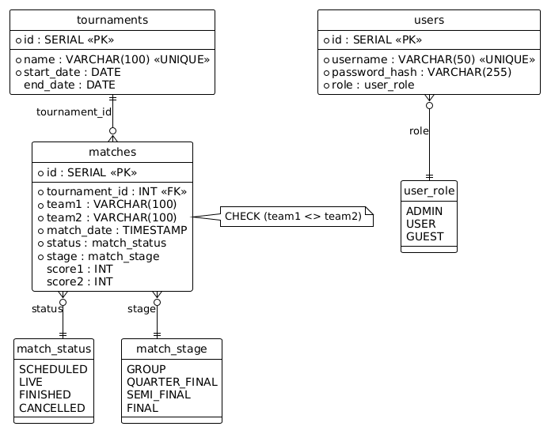

# Агрегатор матчей (PKS Matches)

Информационная система управления футбольными матчами и турнирами с консольным интерфейсом, реляционной СУБД PostgreSQL и усиленным уровнем безопасности.

---

## 🔒 Реализованные системы защиты и бизнес-логики

1. **Криптографическая безопасность паролей**:
   - Стандарт **SHA-256** (`MessageDigest.getInstance("SHA-256")`).
   - Исключены уязвимые 32-битные `hashCode()` и открытые пароли.

2. **Защита от коллизий в расписании**:
   - Автоматический контроль наложений: интервал между матчами с участием одной команды не может быть менее **3 часов** (180 минут).

3. **Бизнес-правила жизненного цикла**:
   - Проверка границ дат: дата матча должна находиться строго в диапазоне `[startDate, endDate]` турнира.
   - Запрет добавления игр в прошедшие турниры (`endDate < now`).
   - Запрет отмены завершённого матча.
   - Запрет изменения счёта завершённого, отменённого или ещё не начатого (`SCHEDULED`) матча.
   - Запрет игры команды с самой собой (`team1 <> team2`).

4. **Защита от переполнения и атак на ввод**:
   - Метод `readLineSafe()` с жёстким лимитом в **100 символов**.
   - `readInt()` с фильтрацией отрицательных чисел и лимитом до `100 000` (макс. 6 символов).
   - Поддержка маскирования ввода пароля через `System.console().readPassword()`.
   - Пункт меню **13 (Logout)** для завершения сессии.

5. **Ограничения на уровне PostgreSQL**:
   - `CHECK (team1 <> team2)`
   - `CHECK (score1 >= 0 AND score2 >= 0)`
   - `CHECK (end_date IS NULL OR end_date >= start_date)`
   - Индексы по турнирам, датам и статусам матчей.

---

## 🚀 Инструкция по сборке и запуску

### 1. Требования
* **JDK**: Java 17+ (рекомендуется JDK 21 или JDK 24).
* **Maven**: 3.8+
* **PostgreSQL**: 14+

### 2. Настройка базы данных
1. Выполните скрипт `src/main/resources/schema.sql` в вашей PostgreSQL.
2. Скопируйте `src/main/resources/db.properties.example` в `db.properties` и укажите ваши параметры подключения:
   ```properties
   db.url=jdbc:postgresql://localhost:5432/pks_matches?characterEncoding=UTF-8
   db.user=postgres
   db.password=your_password
   ```

### 3. Тестирование
Для запуска автоматических тестов безопасности и бизнес-логики:
```powershell
mvn test
```

### 4. Компиляция и запуск
```powershell
# В Windows PowerShell для корректного отображения кириллицы
chcp 65001

# Компиляция
mvn clean compile

# Запуск приложения
mvn exec:java
```

### 5. Учётные записи по умолчанию
* **Администратор**: `admin` / `admin` (полные права: добавление турниров, матчей, пользователей).
* **Пользователь**: `user` / `user` (просмотр расписания, результатов).

---

## 📊 ER-Диаграмма

